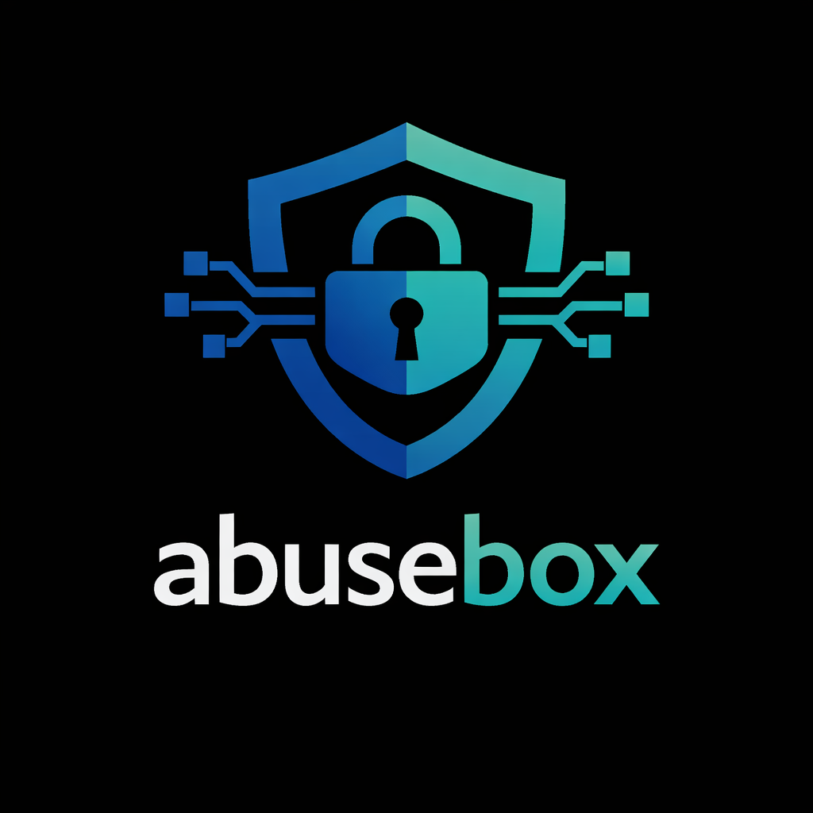
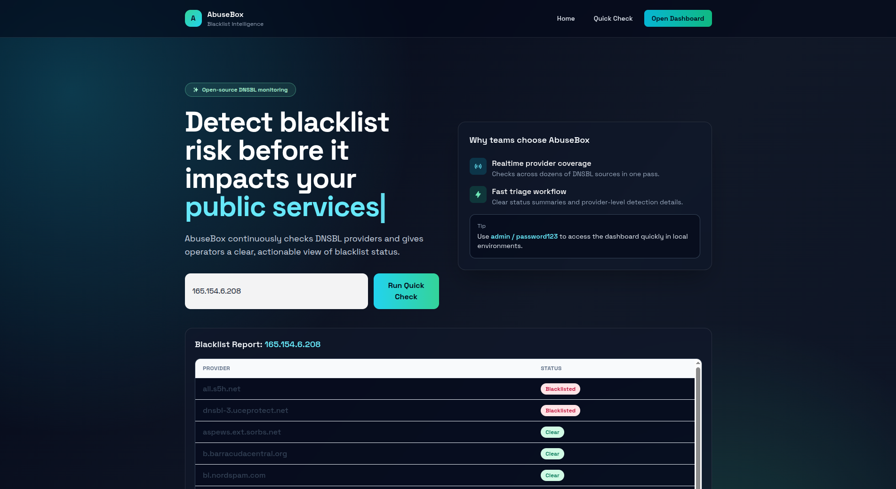
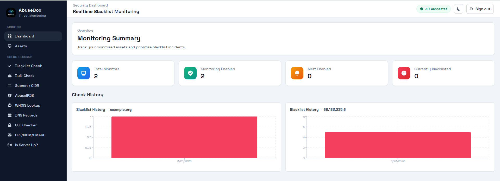
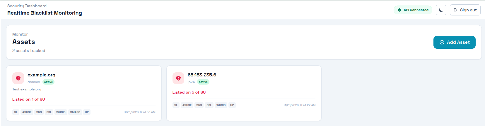
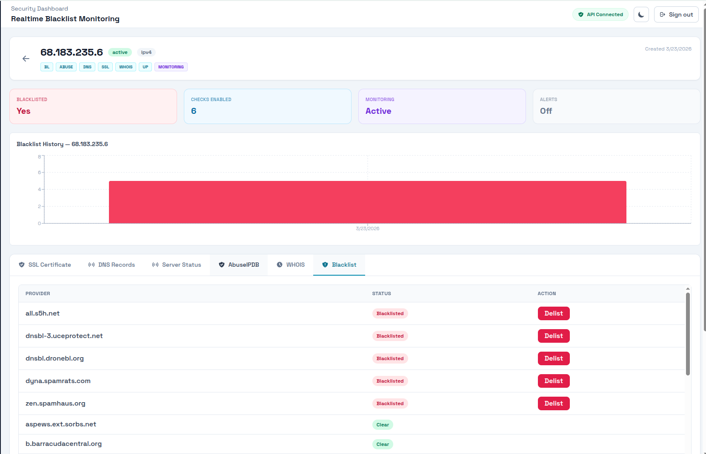

<div align="center">



# AbuseBox

**Open-source threat monitoring toolkit for IPs, domains, and servers.**

Check blacklists, query AbuseIPDB, inspect DNS/SSL/DMARC records, scan subnets, and verify server uptime — all from one dashboard.

[](LICENSE)
[](https://github.com/bekkaze/abusebox/releases)
[](https://github.com/bekkaze/abusebox/stargazers)

</div>

---

## Screenshots

**Landing Page** — instant blacklist check from the homepage



**Dashboard** — monitoring summary with stats and history charts



**Assets** — card-based view of all monitored hostnames with check badges



**Asset Detail** — tabbed results for every enabled check (Blacklist, AbuseIPDB, DNS, SSL, WHOIS, DMARC, Server Status)



---

## Why AbuseBox?

Most blacklist tools check one thing at a time. AbuseBox gives you a **single pane of glass** to:

- Scan **60+ DNSBL providers** in seconds
- Get **AbuseIPDB reputation scores** alongside blacklist results
- Run **bulk checks** on up to 20 IPs/domains at once
- Scan entire **subnets (CIDR /24)** for blacklisted IPs
- Pull **WHOIS**, **DNS records**, and **SSL certificate** details with one click
- Validate **SPF / DKIM / DMARC** email authentication
- Check if a server is **up or down** with DNS, port, and HTTP checks
- **Register assets** and run all checks with configurable toggles
- **Schedule periodic checks** with email and webhook alerts
- Export results to **CSV** and track history with **charts**
- Switch between **light and dark mode**

No vendor lock-in. No paid tiers. Self-host it and own your data.

---

## Features

| Feature | Description | Auth required |
|---|---|---|
| **Blacklist Quick Check** | Scan hostname/IP against 60+ DNSBL providers | No |
| **Bulk Check** | Check up to 20 IPs/domains in a single request | No |
| **Subnet / CIDR Check** | Scan an entire IP range (max /24) against key DNSBL providers | No |
| **AbuseIPDB** | IP reputation score, abuse reports, ISP & geolocation | No |
| **WHOIS Lookup** | Domain registrar, dates, name servers, registrant info | No |
| **DNS Record Viewer** | A, AAAA, MX, TXT, CNAME, NS, SOA, PTR records | No |
| **SSL Certificate Checker** | Validity, expiry, issuer, cipher, SAN list | No |
| **SPF / DKIM / DMARC** | Email authentication validation with A-F grading | No |
| **Is Server Up?** | DNS resolution, port scan (80/443), HTTP status & response time | No |
| **CSV Export** | Download blacklist and subnet results as CSV | No |
| **Assets** | Register domains/IPs and run all checks with per-asset toggles | Yes |
| **Asset Detail View** | Tabbed results for every check type with summary cards | Yes |
| **Scheduled Monitoring** | Automatic periodic re-checks with email/webhook alerts | Yes |
| **Historical Charts** | Visual blacklist history per monitored asset | Yes |
| **Delist Workflow** | Request delisting from supported providers | Yes |
| **Dark Mode** | Toggle between light and dark themes | - |
| **API Documentation** | Swagger UI & ReDoc for all endpoints | No |

---

## Quick Start

### Docker (recommended)

```bash
git clone https://github.com/bekkaze/abusebox
cd abusebox
cp backend/.env.example .env    # configure your settings
docker compose up --build
```

Open `http://localhost:3000` and you're ready to go.

> Default login: `admin` / `password123`

### Manual Setup

<details>
<summary>Click to expand</summary>

**Prerequisites:** Python 3.11+, Node.js 18+, Yarn

**Backend:**

```bash
cd backend
cp .env.example .env
pip install -r requirements.txt
uvicorn app.main:app --host 0.0.0.0 --port 8100 --reload
```

**Frontend** (new terminal):

```bash
cd frontend
cp .env.example .env
yarn install
yarn dev
```

Open `http://localhost:3000`.

</details>

---

## Configuration

Create a `.env` file in the project root (Docker reads it automatically):

```env
APP_SECRET_KEY=replace-this-secret
APP_DEBUG=true
APP_CORS_ALLOWED_ORIGINS=http://localhost:3000
DATABASE_URL=sqlite:///./app.db

# Default admin credentials
DEFAULT_ADMIN_USERNAME=admin
DEFAULT_ADMIN_PASSWORD=password123
DEFAULT_ADMIN_EMAIL=admin@abusebox.local
DEFAULT_ADMIN_PHONE=11111111

# Optional: AbuseIPDB (free key at https://www.abuseipdb.com/account/api)
ABUSEIPDB_API_KEY=

# Scheduled monitoring
SCHEDULER_ENABLED=false
SCHEDULER_INTERVAL_MINUTES=360

# Email alerts (optional)
SMTP_HOST=
SMTP_PORT=587
SMTP_USERNAME=
SMTP_PASSWORD=
SMTP_FROM_EMAIL=
SMTP_USE_TLS=true

# Webhook alerts (optional)
WEBHOOK_URL=
```

| Variable | Description | Required |
|---|---|---|
| `APP_SECRET_KEY` | JWT signing secret (change in production) | Yes |
| `APP_DEBUG` | Enable debug mode | No |
| `DATABASE_URL` | Database connection string (SQLite default) | No |
| `ABUSEIPDB_API_KEY` | Enables AbuseIPDB reputation checks | No |
| `SCHEDULER_ENABLED` | Enable periodic background checks | No |
| `SCHEDULER_INTERVAL_MINUTES` | Check interval in minutes (default: 360) | No |
| `SMTP_HOST` | SMTP server for email alerts | No |
| `WEBHOOK_URL` | Webhook URL for blacklist alert POSTs | No |

> DNS Records, SSL Checker, WHOIS, SPF/DKIM/DMARC, and Server Status work out of the box with no API keys.

Frontend config (`frontend/.env`):

| Variable | Description |
|---|---|
| `VITE_BASE_URL` | Backend URL for Vite proxy (default: `http://localhost:8100`) |

---

## API Endpoints

All tool endpoints are public (no auth required):

```
GET /blacklist/quick-check/?hostname=example.com
GET /tools/abuseipdb/?hostname=8.8.8.8
GET /tools/whois/?hostname=example.com
GET /tools/dns/?hostname=example.com
GET /tools/ssl/?hostname=example.com
GET /tools/email-security/?hostname=example.com
GET /tools/server-status/?hostname=example.com
GET /tools/subnet/?cidr=192.168.1.0/24
GET /tools/bulk-check/?hostnames=example.com,8.8.8.8
GET /tools/export/blacklist/?hostname=example.com
GET /tools/export/subnet/?cidr=192.168.1.0/24
```

Full interactive docs available after startup:

- **Swagger UI:** `http://localhost:8100/swagger/`
- **ReDoc:** `http://localhost:8100/redoc/`

---

## Tech Stack

| Layer | Technology |
|---|---|
| Backend | FastAPI, SQLAlchemy, JWT (python-jose), dnspython |
| Frontend | React 18, Vite 6, Tailwind CSS, Mantine, Recharts |
| Database | SQLite (swappable via `DATABASE_URL`) |
| Deployment | Docker + Docker Compose |

---

## Project Structure

```
abusebox/
├── backend/
│   └── app/
│       ├── api/routers/       # auth, blacklist, hostname, tools
│       ├── core/              # config, JWT security
│       ├── db/                # SQLAlchemy session, seed data
│       ├── models/            # ORM models
│       ├── schemas/           # Pydantic schemas
│       └── services/          # dnsbl, abuseipdb, whois, dns, ssl,
│                              # email security, subnet, export,
│                              # check runner, notifications, scheduler
├── frontend/
│   └── src/
│       ├── pages/             # Landing, Login, Assets, AssetDetail,
│       │                      # Dashboard, Check & Lookup tools
│       ├── components/        # Reusable UI components
│       ├── services/          # API client functions, auth, theme
│       └── routes/            # React Router config
├── docker-compose.yml
└── .env
```

---

## Releases

| Version | Date | Highlights |
|---|---|---|
| **v1.1.0** | March 23, 2026 | Asset management with per-asset check toggles, asset detail page with tabbed results, DNS records, SSL checker, SPF/DKIM/DMARC, bulk check, subnet scan, scheduled monitoring, email/webhook alerts, historical charts, CSV export, dark mode, 60 DNSBL providers, security & bug fixes |
| **v1.0.0** | March 2, 2026 | Initial release — DNSBL monitoring, dashboard, delist workflow |

See [CHANGELOG.md](CHANGELOG.md) for full details.

---

## Contributing

Contributions are welcome! Please read [CONTRIBUTING.md](CONTRIBUTING.md) before submitting a PR.

## License

MIT — see [LICENSE](LICENSE) for details.

---

<div align="center">

**If AbuseBox helps you, consider giving it a star!**

[](https://github.com/bekkaze/abusebox/stargazers)

</div>
