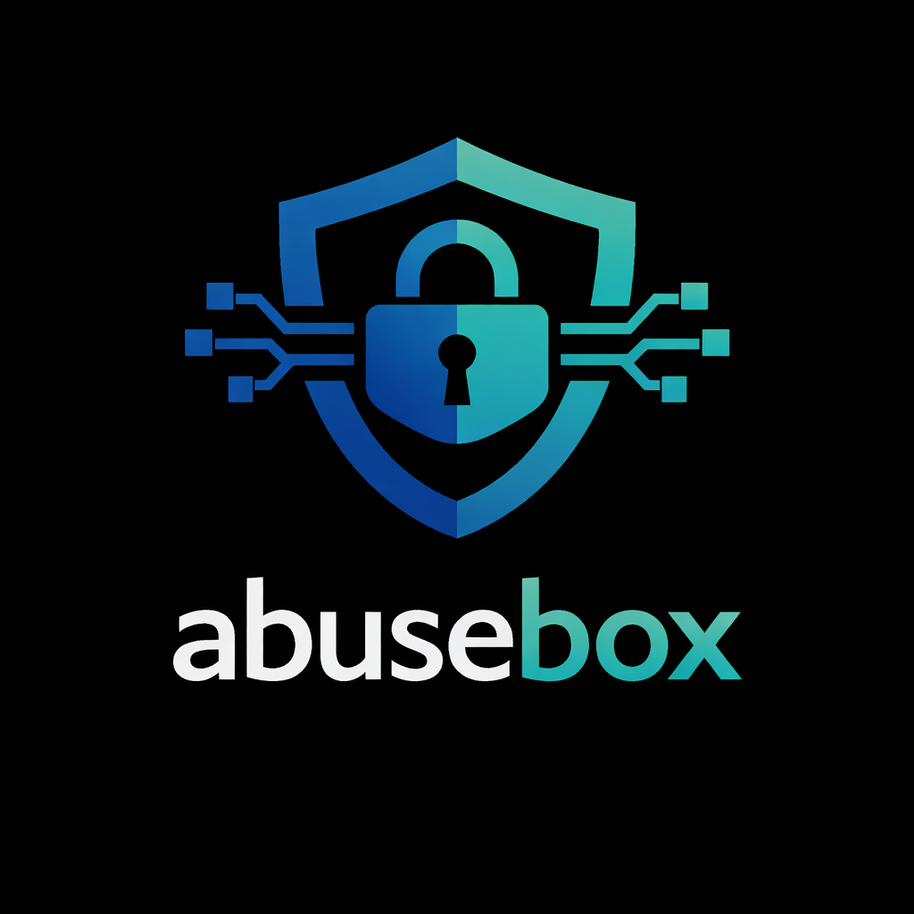
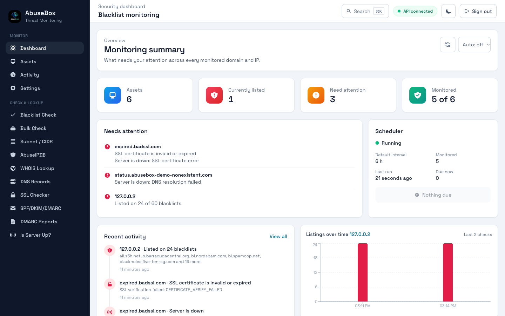
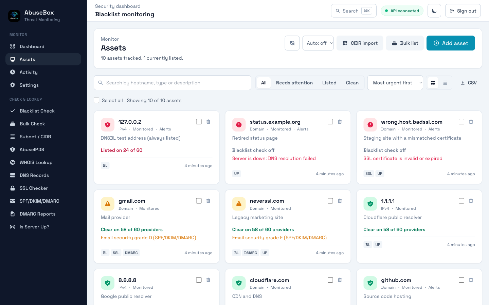
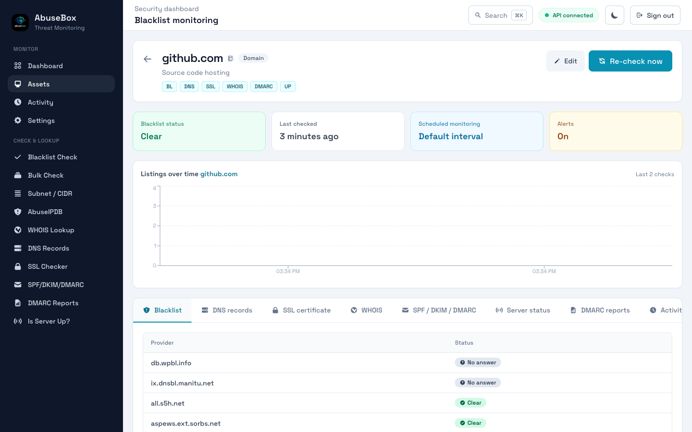
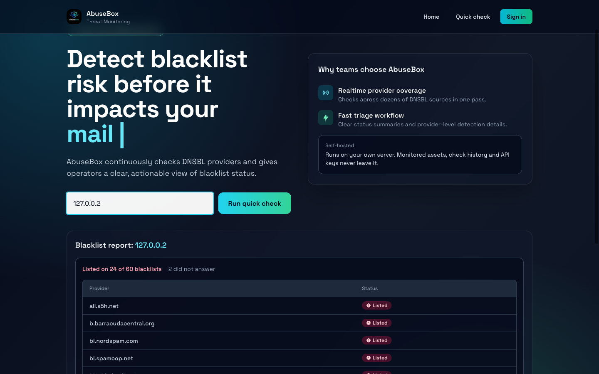
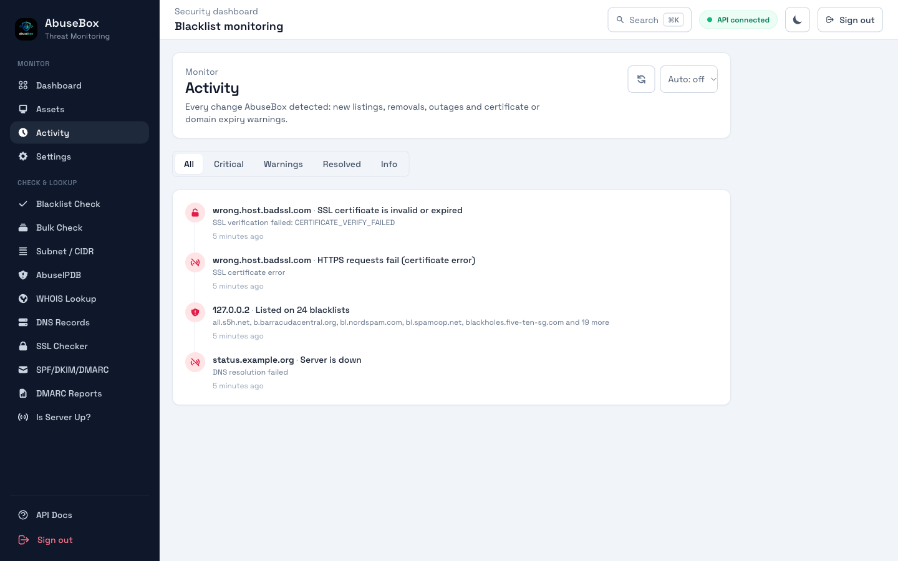
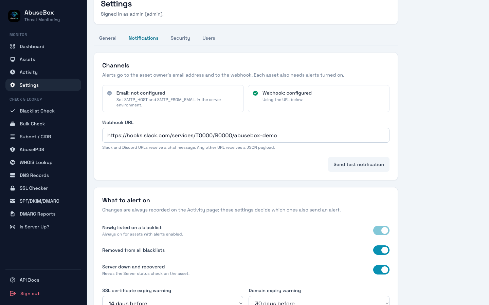
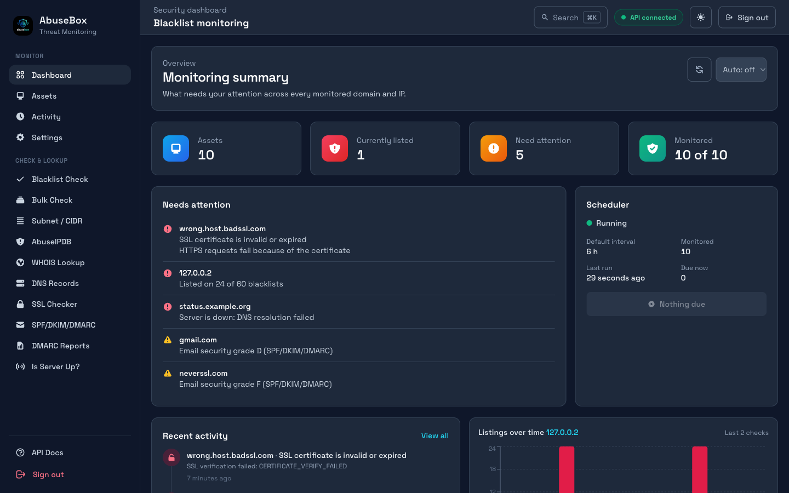
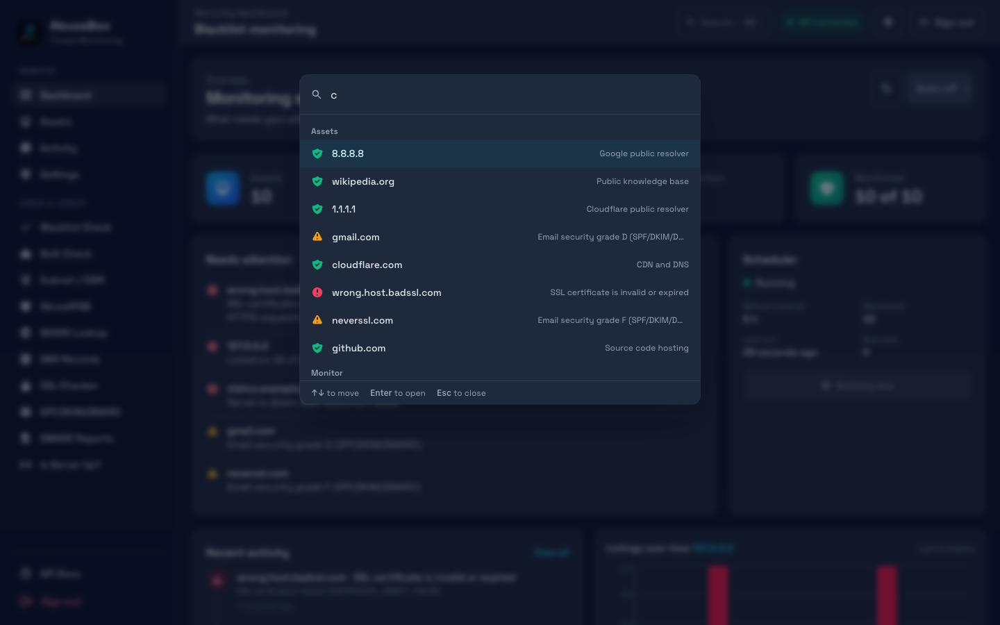

<div align="center">



# AbuseBox

**Open-source threat monitoring toolkit for IPs, domains, and servers.**

Check blacklists, query AbuseIPDB, inspect DNS/SSL/DMARC records, scan subnets and verify uptime, then get told when something changes. One self-hosted dashboard.

[](LICENSE)
[](https://github.com/bekkaze/abusebox/releases)
[](https://github.com/bekkaze/abusebox/stargazers)

</div>

---

## Screenshots

**Dashboard**: everything that needs attention across your assets, scheduler status, recent activity and listing history



**Assets**: health at a glance, filters, sorting, card or table view, and bulk actions



**Asset detail**: results for every check, plus the asset's activity and a check-by-check history



**Landing page**: anyone can run a quick blacklist check, no account needed



<table>
  <tr>
    <td width="50%"><b>Activity log</b>: every change, with severity filters<br></td>
    <td width="50%"><b>Alerts</b>: email, Slack, Discord or any webhook, with a test button<br></td>
  </tr>
  <tr>
    <td width="50%"><b>Dark mode</b><br></td>
    <td width="50%"><b>Command palette</b> (Ctrl/Cmd + K): jump to any asset or page<br></td>
  </tr>
</table>

---

## Why AbuseBox?

Most blacklist tools check one thing at a time. AbuseBox gives you a **single pane of glass** to:

- See **what needs attention** in one list: blacklist listings, expiring certificates and domains, servers down, weak email security
- Scan **60 DNSBL providers** in seconds
- Get **AbuseIPDB reputation scores** alongside blacklist results
- Run **bulk checks** on up to 300 IPs/domains at once (paste or upload TXT/CSV/XLSX)
- Scan entire **subnets (CIDR /24)** for blacklisted IPs
- Pull **WHOIS**, **DNS records**, and **SSL certificate** details with one click
- Validate **SPF / DKIM / DMARC** email authentication
- Check if a server is **up or down** with DNS, port, and HTTP checks
- **Register assets** and run all checks with configurable toggles
- **Schedule periodic checks** with email, Slack, Discord or webhook alerts for listings, recoveries, outages and expiry
- Keep an **activity log** of every change and compare any two checks
- Export results to **CSV** and track history with **charts**
- Switch between **light and dark mode**

No vendor lock-in. No paid tiers. Self-host it and own your data.

---

## Features

| Feature | Description | Auth required |
|---|---|---|
| **Needs-attention dashboard** | Listings, invalid/expiring SSL, expiring domains, servers down, weak email security, overdue checks, scheduler status | Yes |
| **Activity log** | Every detected change (listed, delisted, down, recovered, expiring) with severity filters | Yes |
| **Alerts** | Email and webhook (Slack/Discord formatted) for new listings, removals, outages and expiry warnings, with a test button | Yes |
| **Blacklist Quick Check** | Scan hostname/IP against 60 DNSBL providers (rate limited for anonymous use) | No |
| **Bulk Check** | Check up to 300 IPs/domains at once, from a list or a TXT/CSV/XLSX file | Yes |
| **Subnet / CIDR Check** | Scan an entire IP range (max /24) against key DNSBL providers | Yes |
| **AbuseIPDB** | IP reputation score, abuse reports, ISP & geolocation | Yes |
| **WHOIS Lookup** | Domain registrar, dates, name servers, registrant info | Yes |
| **DNS Record Viewer** | A, AAAA, MX, TXT, CNAME, NS, SOA, PTR records | Yes |
| **SSL Certificate Checker** | Validity, expiry, issuer, cipher, SAN list | Yes |
| **SPF / DKIM / DMARC** | Email authentication validation with A-F grading, custom DKIM selectors | Yes |
| **Is Server Up?** | DNS resolution, port scan (80/443), HTTP status & response time | Yes |
| **CSV Export** | Download blacklist and subnet results as CSV | - |
| **Bulk Asset Import** | Add up to 300 assets at once from a pasted list or TXT/CSV/XLSX file | Yes |
| **CIDR Import** | Import an IP range (max /24) as monitored assets from the UI | Yes |
| **Assets** | Register domains/IPs, run all checks with per-asset toggles, edit them later | Yes |
| **Bulk Actions** | Select many assets to re-check (in the background), toggle monitoring/alerts or delete; table view, sorting, CSV export | Yes |
| **Check History** | Browse past checks and see which blacklists were added or removed | Yes |
| **Asset Detail View** | Tabbed results for every check type with summary cards | Yes |
| **Scheduled Monitoring** | Automatic re-checks on a global or per-asset interval, with a "check due assets now" button | Yes |
| **Historical Charts** | Visual blacklist history per monitored asset | Yes |
| **Re-check Asset** | Re-run all enabled checks on any asset with one click | Yes |
| **Delist Tracking** | Links to each provider's removal page and tracks requested removals | Yes |
| **Search & Filter** | Search assets by hostname, type or description; filter by needs attention, listed or clean | Yes |
| **Auto-refresh** | Configurable auto-refresh (30s/1m/5m) on Dashboard and Assets | Yes |
| **Copy to Clipboard** | One-click copy on IPs, DNS records, WHOIS data, SSL details | - |
| **Relative Timestamps** | "2 hours ago" with full datetime tooltip on hover | - |
| **Dark Mode** | Toggle between light and dark themes, persisted to localStorage | - |
| **Responsive Layout** | Collapsible sidebar with hamburger menu on mobile | - |
| **Favicon Alert** | Red badge on favicon when any asset is blacklisted | - |
| **Users** | Admins add users, grant admin, deactivate and reset passwords; everyone can change their own password | Yes |
| **Data Retention** | Optionally delete history older than 30–365 days | Yes |
| **Command Palette** | Ctrl/Cmd + K to jump to any asset, page or setting, or check a domain/IP | Yes |
| **API Documentation** | Swagger UI & ReDoc for all endpoints | No |

---

## Quick Start

### Docker (recommended)

```bash
git clone https://github.com/bekkaze/abusebox
cd abusebox
cp backend/.env.example .env    # configure your settings
docker compose up --build
```

Open `http://localhost:3000` and you're ready to go.

> Default login: `admin` / `password123`. **Change it in Settings right after the first sign-in.**
>
> To open AbuseBox from another machine, add that hostname or IP to `VITE_ALLOWED_HOSTS` and `APP_CORS_ALLOWED_ORIGINS` in `.env`.

### Manual Setup

<details>
<summary>Click to expand</summary>

**Prerequisites:** Python 3.11+, Node.js 20.19+, Yarn

**Backend:**

```bash
cd backend
cp .env.example .env
pip install -r requirements.txt
uvicorn app.main:app --host 0.0.0.0 --port 8100 --reload
```

**Frontend** (new terminal):

```bash
cd frontend
cp .env.example .env
yarn install
yarn dev
```

Open `http://localhost:3000`.

</details>

### Upgrading from v1.1.x

Back up your data first, then pull the new version. The database is migrated automatically on start.

```bash
# The volume is named <folder>_abusebox-data; `docker volume ls` shows it.
docker run --rm -v abusebox_abusebox-data:/data -v "$PWD":/backup alpine tar czf /backup/abusebox-data.tgz -C /data .
git pull
docker compose up -d --build
```

Things that changed:

- **Everyone is signed out once.** Older Docker setups used a published JWT secret; v1.2.0 generates a private one (or uses your `APP_SECRET_KEY`).
- **Change the admin password.** Older Docker setups ignored `DEFAULT_ADMIN_PASSWORD` from `.env`, so the admin account probably still uses `password123`. A banner reminds you until you change it in **Settings → Security**.
- **The `/tools/*` API needs a token.** Only `/blacklist/quick-check/` stays public. See [API Endpoints](#api-endpoints).
- **No public sign-up.** Admins add users in **Settings → Users**.
- **The scheduler is on by default** unless you turned it off in Settings before.

---

## Configuration

Create a `.env` file in the project root (Docker Compose reads it automatically, and values in it override the compose defaults):

```env
# Leave empty to auto-generate a secret (stored next to the database)
APP_SECRET_KEY=
APP_DEBUG=false
APP_CORS_ALLOWED_ORIGINS=http://localhost:3000
VITE_ALLOWED_HOSTS=localhost,127.0.0.1
DATABASE_URL=sqlite:///./app.db   # ignored by Docker Compose (always uses the data volume)

# Default admin, created on first start only
DEFAULT_ADMIN_USERNAME=admin
DEFAULT_ADMIN_PASSWORD=password123
DEFAULT_ADMIN_EMAIL=admin@abusebox.local
DEFAULT_ADMIN_PHONE=11111111

# Optional: AbuseIPDB (free key at https://www.abuseipdb.com/account/api)
ABUSEIPDB_API_KEY=

# Scheduled monitoring
SCHEDULER_ENABLED=true
SCHEDULER_INTERVAL_MINUTES=360

# Email alerts (optional)
SMTP_HOST=
SMTP_PORT=587
SMTP_USERNAME=
SMTP_PASSWORD=
SMTP_FROM_EMAIL=
SMTP_USE_TLS=true

# Webhook alerts (optional)
WEBHOOK_URL=
```

| Variable | Description | Required |
|---|---|---|
| `APP_SECRET_KEY` | JWT signing secret. If unset, a random one is generated and saved as `.secret_key` next to the database | No |
| `APP_DEBUG` | Show error tracebacks (development only) | No |
| `APP_CORS_ALLOWED_ORIGINS` | Comma-separated browser origins allowed to call the API | No |
| `DATABASE_URL` | Database connection string (SQLite default) | No |
| `ABUSEIPDB_API_KEY` | Enables AbuseIPDB reputation checks | No |
| `SCHEDULER_ENABLED` | Run periodic background checks (default: `true`; can also be changed in Settings) | No |
| `SCHEDULER_INTERVAL_MINUTES` | Check interval in minutes (default: 360) | No |
| `SMTP_HOST` | SMTP server for email alerts | No |
| `WEBHOOK_URL` | Webhook URL for alerts (Slack and Discord URLs get chat messages). A URL set in Settings → Notifications takes precedence | No |
| `DNSBL_NAMESERVERS` | Comma-separated DNS resolvers for blacklist lookups. Spamhaus and some others refuse public resolvers; point this at your own recursive resolver for complete results | No |

> DNS Records, SSL Checker, WHOIS, SPF/DKIM/DMARC, and Server Status work out of the box with no API keys.

Frontend config (`frontend/.env`):

| Variable | Description |
|---|---|
| `VITE_BASE_URL` | Backend URL for Vite proxy (default: `http://localhost:8100`) |
| `VITE_ALLOWED_HOSTS` | Hostnames the dev server answers to (default: `localhost,127.0.0.1`) |

---

## API Endpoints

Only the blacklist quick check is public (rate limited to 10 requests per minute per IP). Every other endpoint needs a bearer token from `POST /user/login/`:

```
GET  /blacklist/quick-check/?hostname=example.com      # public
GET  /tools/abuseipdb/?hostname=8.8.8.8
GET  /tools/whois/?hostname=example.com
GET  /tools/dns/?hostname=example.com
GET  /tools/ssl/?hostname=example.com
GET  /tools/email-security/?hostname=example.com&dkim_selectors=s1,s2
GET  /tools/server-status/?hostname=example.com
GET  /tools/subnet/?cidr=203.0.113.0/24
POST /tools/bulk-check/                  # {"hostnames": ["example.com", "8.8.8.8"]}
POST /tools/bulk-check-upload/           # multipart file: .txt, .csv or .xlsx
GET  /tools/export/blacklist/?hostname=example.com
GET  /tools/export/subnet/?cidr=203.0.113.0/24
POST /hostname/bulk/                     # up to 300 assets
POST /hostname/cidr-import/
POST /hostname/{id}/recheck/
POST /hostname/bulk-action/             # {"ids": [1, 2], "action": "recheck"}
GET  /hostname/list/?include_result=false
GET  /hostname/{id}/checks/{check_id}
GET  /hostname/{id}/events/
GET  /events/?severity=critical
GET  /settings/scheduler/status/
POST /settings/scheduler/run/            # admin only: check due assets now
PUT  /settings/notifications/            # admin only
POST /settings/notifications/test/       # admin only
POST /user/change-password/
POST /user/create/                       # admin only
GET  /user/list/                         # admin only
PATCH /user/{id}/                        # admin only
```

```bash
TOKEN=$(curl -s -X POST localhost:8100/user/login/ -H 'Content-Type: application/json' \
  -d '{"username":"admin","password":"your-password"}' | jq -r .access)
curl -s -H "Authorization: Bearer $TOKEN" "localhost:8100/tools/dns/?hostname=example.com"
```

Full interactive docs available after startup:

- **Swagger UI:** `http://localhost:8100/swagger/`
- **ReDoc:** `http://localhost:8100/redoc/`

---

## Tech Stack

| Layer | Technology |
|---|---|
| Backend | Python 3.11, FastAPI, SQLAlchemy 2, PyJWT, dnspython |
| Frontend | React 18, React Router 7, Vite 6, Tailwind CSS 3, Headless UI, Recharts |
| Database | SQLite (swappable via `DATABASE_URL`) |
| Deployment | Docker + Docker Compose; images published to GHCR |
| CI | GitHub Actions: backend tests, frontend lint and build |

---

## Project Structure

```
abusebox/
├── backend/
│   ├── app/
│   │   ├── api/routers/       # auth, blacklist, dmarc, events, hostname, settings, tools
│   │   ├── core/              # config, JWT security, SSRF guards, client IP, UTC helpers
│   │   ├── db/                # SQLAlchemy session, seed data
│   │   ├── models/            # users, assets, check history, events, DMARC, settings
│   │   ├── schemas/           # Pydantic schemas
│   │   └── services/          # checks: dnsbl, abuseipdb, dns, ssl, whois, email security,
│   │                          #   server status, subnet, DMARC parser, export
│   │                          # monitoring: monitoring (save + events + alerts), health,
│   │                          #   events, scheduler, notifications
│   └── tests/                 # pytest (offline suite + live DNSBL cross-checks)
├── frontend/
│   └── src/
│       ├── pages/             # Landing, Login, Dashboard, Assets, Asset detail, Activity,
│       │                      # Settings, Check & Lookup tools
│       ├── components/        # shared UI (forms, alerts, activity feed, command palette),
│       │                      # dashboard, blacklist tables, dialogs
│       ├── services/          # API clients, auth, theme, current user
│       └── routes/            # React Router config
├── files/                     # logo and README screenshots
├── docker-compose.yml
└── .env                       # your configuration (not committed)
```

---

## Releases

| Version | Date | Highlights |
|---|---|---|
| **v1.2.0** | October 7, 2026 | Needs-attention dashboard, activity log, recovery/outage/expiry alerts (Slack, Discord, webhooks), bulk actions and table view, check history, user management, command palette; scheduler fix (#20), security hardening, dependency updates, accessibility and dark mode overhaul |
| **v1.1.2** | March 26, 2026 | Bulk asset import, CIDR import, auto-refresh auth, persistent DB, DNSBL false positive fix, community bug fixes |
| **v1.1.1** | March 25, 2026 | UX polish, responsive mobile layout, asset re-check, code splitting, security fixes |
| **v1.1.0** | March 23, 2026 | Asset management, DNS/SSL/DMARC tools, bulk & subnet check, scheduled monitoring, dark mode, 60+ DNSBL providers |
| **v1.0.1** | March 19, 2026 | AbuseIPDB, WHOIS lookup, server status checker, security hardening |
| **v1.0.0** | March 2, 2026 | Initial release — DNSBL monitoring, dashboard, delist workflow |

See [CHANGELOG.md](CHANGELOG.md) for full details.

---

## Contributing

Contributions are welcome! Please read [CONTRIBUTING.md](CONTRIBUTING.md) before submitting a PR.

## License

MIT — see [LICENSE](LICENSE) for details.

---

<div align="center">

**If AbuseBox helps you, consider giving it a star!**

[](https://github.com/bekkaze/abusebox/stargazers)

</div>
